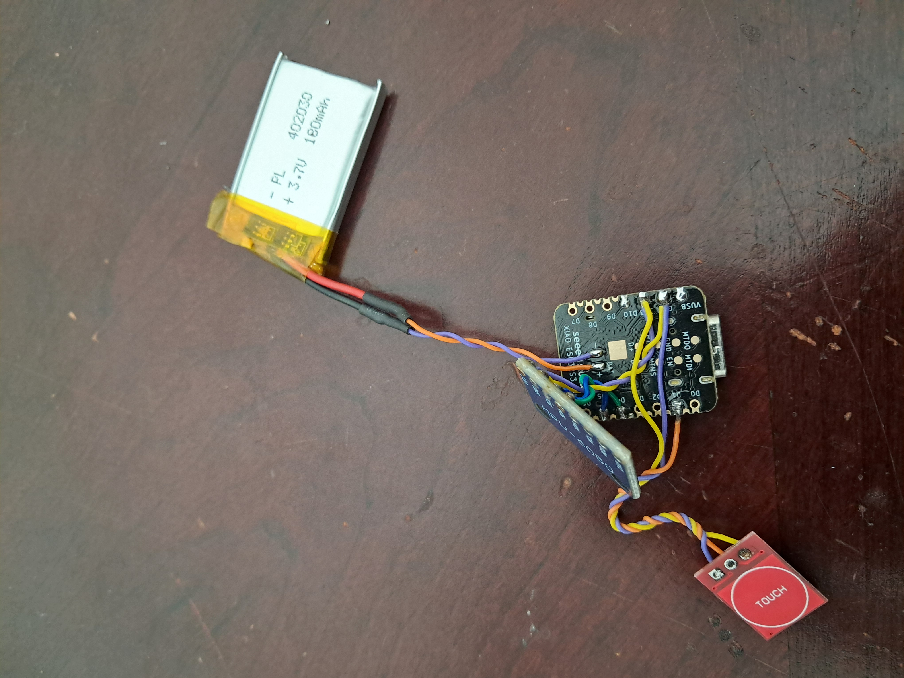
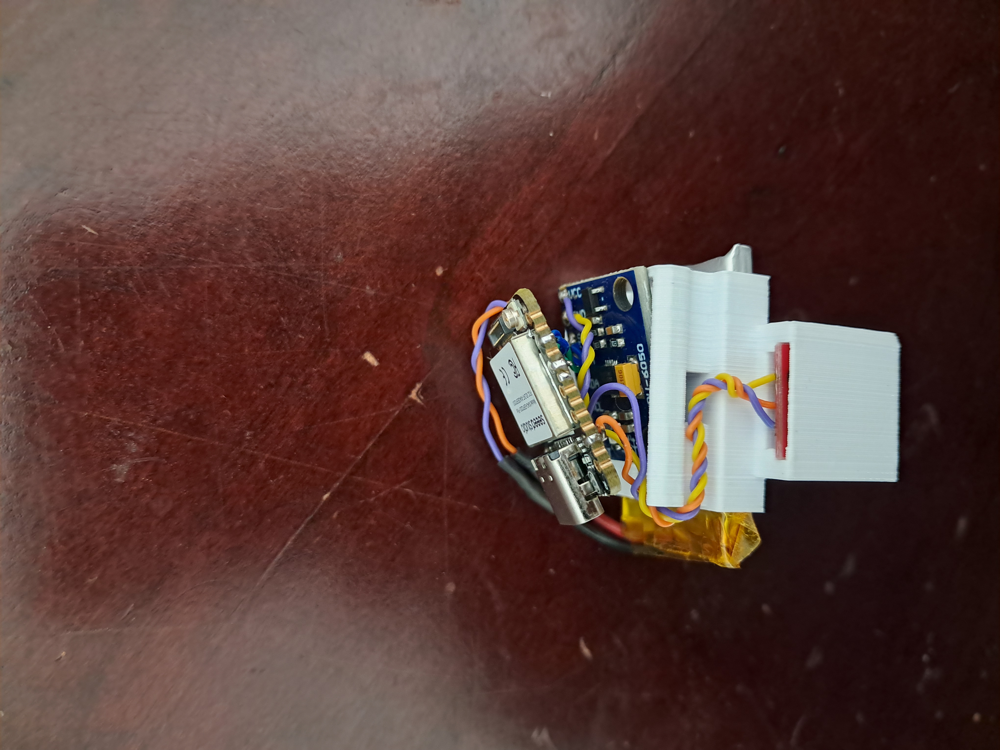
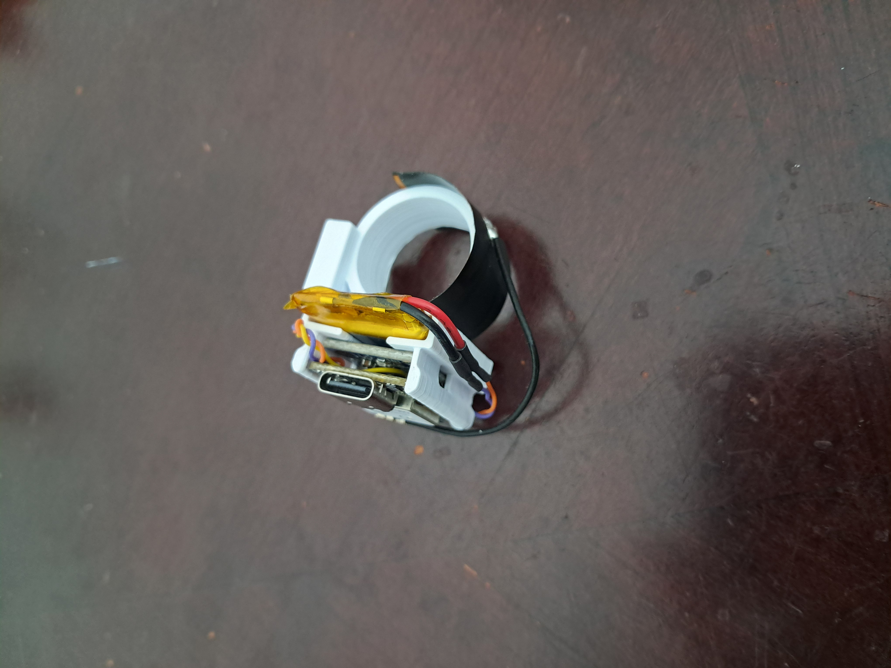
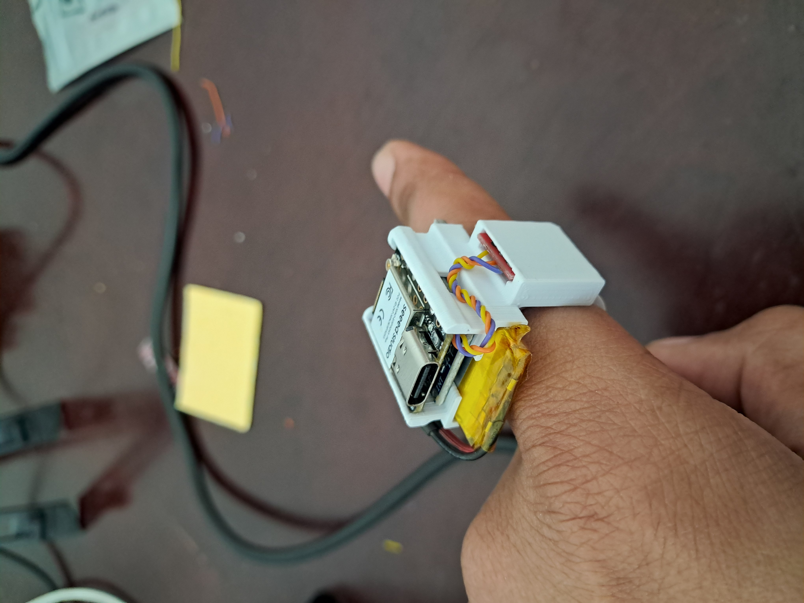

# AirWrite-Ring

This project is currently in progress.

AirWrite-Ring is a wearable system built using the Seeed XIAO ESP32S3 and MPU6050 sensor.  
It aims to recognize letters or gestures drawn in the air.  
A TTP223 touch sensor acts as a trigger switch to start or stop inference.  
A 1D-CNN model will eventually run on the ESP32S3 to classify gestures and send send the detected characters to a Python script on a PC via BLE.

---

## Hardware Setup

### Pin Connections

| Device | Pin | ESP32S3 Pin | Notes |
|--------|-----|--------------|-------|
| **MPU6050** | VCC | 3.3V | Power supply |
|  | GND | GND | Common ground |
|  | SDA | D4 | I2C data line |
|  | SCL | D5 | I2C clock line |
| **TTP223 Touch Sensor** | VCC | 3.3V | Power supply |
|  | GND | GND | Common ground |
|  | OUT | D1 | Touch output signal |
| **Battery** | + | BAT+ pad | Soldered directly |
|  | - | GND pad | Soldered directly |

---

The **3D printed case** used for this project, along with its design files, is available in the **`STL/`** folder.  
You can directly print the provided STL file or modify it as needed.

---

## Credits
Some design and mechanical ideas were inspired by the following open-source projects and creators:

- [3D printed case for the TTP223 touch module](https://www.printables.com/model/180416-touch-sensor-ttp223-for-fischertechnik)

- [3D printed holder for Xiao esp32s3](https://www.printables.com/model/612603-holder-for-seeed-xiao-esp32c3-and-esp32s3)


## Assembly and Prototype
Connect the MPU6050 and TTP223 sensor to the XIAO ESP32S3 according to the table above.  
Power the system with a Li-Po battery connected to the BAT+ and GND pads.

 
 
 
 

---

## Getting Started

### Clone this repository
```bash
git clone https://github.com/adityabangde/AirWrite-Ring.git
cd airwrite-ring
```
---


### Install Python dependencies

Make sure you have **Python 3.8+** and **pip** installed, then run:

```bash
pip install -e .
```
